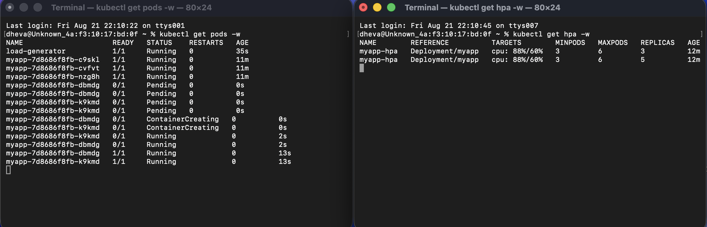
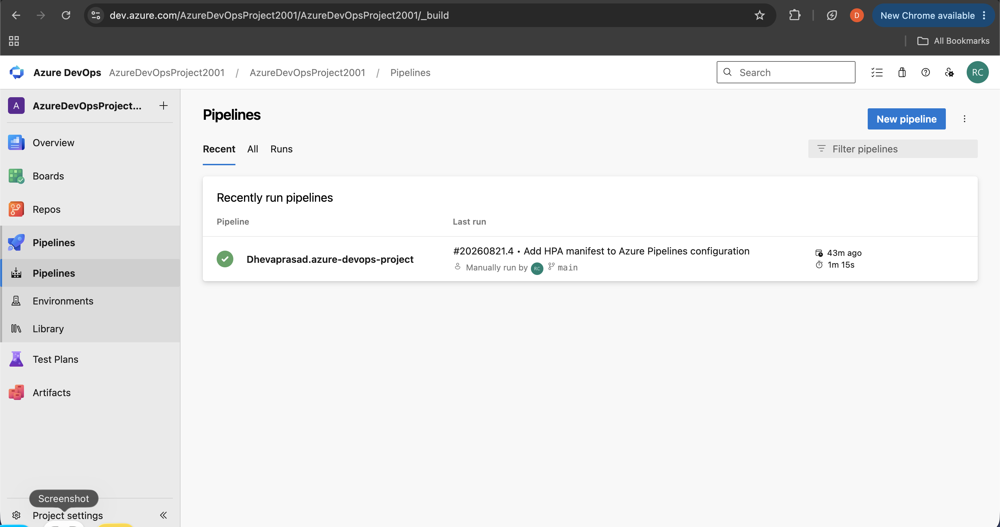
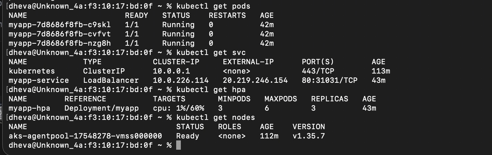
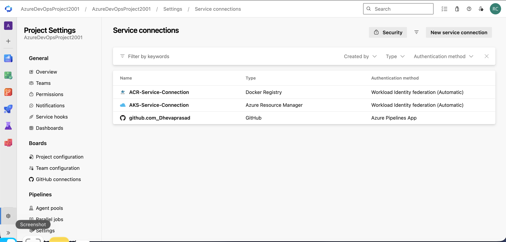

# Azure DevOps CI/CD Pipeline with AKS, ACR & HPA

An end-to-end DevOps project demonstrating how to build, test, containerize, deploy, and automatically scale a Python Flask application using **Terraform, Docker, Azure Container Registry, Azure Kubernetes Service, and Azure DevOps CI/CD**.

---

## 🚀 Project Overview

This project implements a complete CI/CD workflow where application code is maintained in GitHub and automatically built, tested, containerized, pushed to Azure Container Registry, and deployed to Azure Kubernetes Service through an Azure DevOps YAML pipeline.

The application is exposed externally using a Kubernetes `LoadBalancer` Service and automatically scales based on CPU utilization using Kubernetes Horizontal Pod Autoscaler (HPA).

### End-to-End Flow

    Developer
        |
        | Git Push
        v
    GitHub Repository
        |
        | Trigger
        v
    Azure DevOps Pipeline
        |
        +--> Install Python Dependencies
        |
        +--> Run PyTest
        |
        +--> Docker@2
        |       |
        |       v
        |   Build Docker Image
        |       |
        |       v
        |   Push Image
        |       |
        |       v
        |   Azure Container Registry
        |
        +--> KubernetesManifest@1
                |
                v
            Azure Kubernetes Service
                |
                +--> Deployment
                |
                +--> LoadBalancer Service
                |
                +--> Health Probes
                |
                +--> Horizontal Pod Autoscaler

---

## 🏗️ Architecture

    GitHub
       |
       v
    Azure DevOps
       |
       +---- PyTest
       |
       +---- Docker@2
       |       |
       |       v
       |      ACR
       |       |
       |       v
       |     Image
       |
       +---- KubernetesManifest@1
               |
               v
              AKS
               |
               +---- Deployment
               |
               +---- Health Probes
               |
               +---- LoadBalancer
               |
               +---- HPA
                     |
                     +---- 3 to 6 Pods

---

## 🛠️ Technologies Used

- **Azure**
- **Azure DevOps**
- **Azure Kubernetes Service (AKS)**
- **Azure Container Registry (ACR)**
- **Terraform**
- **Docker**
- **Kubernetes**
- **Python**
- **Flask**
- **PyTest**
- **Git**
- **GitHub**
- **YAML**
- **Azure RBAC**
- **Workload Identity Federation (OIDC)**
- **Horizontal Pod Autoscaler (HPA)**

---

## 📁 Project Structure

    azure-devops-project/
    │
    ├── app/
    │   ├── app.py
    │   ├── requirements.txt
    │   └── test_app.py
    │
    ├── k8s/
    │   ├── deployment.yaml
    │   ├── service.yaml
    │   └── hpa.yaml
    │
    ├── terraform/
    │   ├── provider.tf
    │   ├── variables.tf
    │   ├── main.tf
    │   └── outputs.tf
    │
    ├── Dockerfile
    ├── azure-pipelines.yml
    ├── .gitignore
    └── README.md

---

# 1. 🐍 Application

A simple Python Flask application was developed as the application workload.

The application exposes:

    /

and a health endpoint:

    /health

The `/health` endpoint is used by Kubernetes probes and for manually verifying that the application is running correctly.

---

# 2. 🧪 Application Testing

PyTest is used to validate the application before containerization and deployment.

Install dependencies:

    python3 -m pip install flask pytest

Run tests:

    pytest

The same test stage is also executed automatically inside the Azure DevOps pipeline.

---

# 3. 🐳 Docker

The Flask application is containerized using Docker.

Build the image locally:

    docker build -t myapp:v1 .

Run the container:

    docker run -d -p 5000:5000 --name myapp myapp:v1

Test the application:

    curl http://localhost:5000

Health check:

    curl http://localhost:5000/health

---

# 4. ☁️ Terraform Infrastructure

Terraform is used to provision the Azure infrastructure.

The Terraform configuration creates:

- Azure Resource Group
- Azure Container Registry
- Azure Kubernetes Service
- AKS managed identity
- ACR pull role assignment
- Required Azure RBAC permissions

### Initialize Terraform

    terraform init

Initializes the Terraform working directory and downloads the required provider.

### Validate Configuration

    terraform validate

Validates the Terraform configuration syntax and structure.

### Create Execution Plan

    terraform plan

Shows the Azure resources Terraform plans to create or modify.

### Deploy Infrastructure

    terraform apply

Creates the infrastructure in Azure.

### Destroy Infrastructure

    terraform destroy

Removes the Terraform-managed Azure infrastructure when the environment is no longer required.

---

# 5. 📦 Azure Container Registry

Azure Container Registry is used to store Docker images.

The application image is pushed to:

    acrdevopsproject2026.azurecr.io

Repository:

    myapp

Image tags are generated using the Azure DevOps build ID.

Example:

    acrdevopsproject2026.azurecr.io/myapp:<Build ID>

ACR stores the container image that AKS later pulls.

---

# 6. 🔄 Azure DevOps CI/CD

The project uses an Azure DevOps YAML pipeline.

The pipeline performs the following stages:

    Checkout Code
          ↓
    Install Python
          ↓
    Install Dependencies
          ↓
    Run PyTest
          ↓
    Build Docker Image
          ↓
    Push Image to ACR
          ↓
    Deploy Kubernetes Manifests
          ↓
    Deploy Application to AKS

### Docker@2

Used to:

- Build the Docker image
- Authenticate with ACR
- Push the image to ACR

### KubernetesManifest@1

Used to:

- Deploy Kubernetes manifests
- Update the application image
- Deploy the application to AKS
- Roll out the application

---

# 7. 🔐 Workload Identity Federation

Azure DevOps service connections use **Workload Identity Federation (OIDC)** instead of storing long-lived client secrets.

Two service connections were configured:

    ACR-Service-Connection
            |
            +--> ACR authentication
            +--> AcrPull permission

    AKS-Service-Connection
            |
            +--> AKS authentication
            +--> AKS deployment permissions

This provides a secure authentication mechanism without storing long-lived Azure credentials inside the pipeline.

### Identity Flow

    Azure DevOps
          |
          | OIDC / WIF
          v
    Azure Entra ID
          |
          v
    Azure RBAC
          |
          +------> ACR
          |
          +------> AKS

---

# 8. ☸️ Kubernetes Deployment

The application is deployed to AKS using Kubernetes manifests.

The Deployment manages the application Pods.

Initial configuration:

    Minimum Pods: 3

The Deployment also defines CPU and memory resource requests/limits.

Example:

    resources:
      requests:
        cpu: "100m"
        memory: "128Mi"
      limits:
        cpu: "500m"
        memory: "256Mi"

The CPU request is important for our CPU-based HPA because HPA calculates CPU utilization relative to the requested CPU.

---

# 9. ❤️ Kubernetes Health Probes

The Kubernetes Deployment uses the application's `/health` endpoint for health monitoring.

### Readiness Probe

The readiness probe determines whether a Pod is ready to receive traffic.

If the application is not ready, Kubernetes prevents the Pod from receiving traffic through the Service until the readiness check succeeds.

### Liveness Probe

The liveness probe checks whether the application container is still functioning correctly.

If the application becomes unhealthy and repeatedly fails the liveness check, Kubernetes can restart the container.

Health endpoint:

    /health

Conceptually:

    Readiness Probe
          |
          v
    "Should this Pod receive traffic?"
          |
          v
    Service routing

    Liveness Probe
          |
          v
    "Is this container still healthy?"
          |
          v
    Restart if necessary

---

# 10. 🌐 Kubernetes LoadBalancer

The application is exposed using a Kubernetes `LoadBalancer` Service.

Service type:

    kind: Service
    type: LoadBalancer

Azure provisions a public IP for the service.

Traffic flow:

    Internet
       |
       v
    Azure Public IP
       |
       v
    LoadBalancer Service
       |
       v
    Application Pods

The Service uses a selector to identify the application Pods.

Traffic flow:

    Public IP:80
         |
         v
    Service:80
         |
         v
    Pod:5000
         |
         v
    Flask Application

---

# 11. 📈 Horizontal Pod Autoscaler

Horizontal Pod Autoscaler (HPA) is configured using the Kubernetes `autoscaling/v2` API.

Configuration:

    Target Deployment: myapp
    Minimum Replicas: 3
    Maximum Replicas: 6
    CPU Target: 60%

The HPA targets the `myapp` Deployment:

    scaleTargetRef:
      apiVersion: apps/v1
      kind: Deployment
      name: myapp

CPU-based scaling is configured using:

    metrics:
      - type: Resource
        resource:
          name: cpu
          target:
            type: Utilization
            averageUtilization: 60

Conceptually:

          CPU < 60%
              |
              v
          3 Pods

          CPU > 60%
              |
              v
       HPA increases replicas
              |
              v
          3 → 5 → 6 Pods

---

# 12. 🔥 HPA Testing

HPA was tested by generating continuous traffic against the application.

A temporary load generator was deployed inside the Kubernetes cluster:

    Load Generator
          |
          v
    myapp-service
          |
          v
    Application Pods

During testing, CPU utilization increased to approximately:

    88–90%

The HPA automatically scaled the application:

    3 Pods
       ↓
    5 Pods
       ↓
    6 Pods

After the load generator was stopped, CPU utilization dropped to approximately:

    1%

After the HPA stabilization period, the application automatically scaled back down:

    6 Pods
       ↓
    3 Pods

This successfully demonstrated both:

- **Scale-up**
- **Scale-down**

---

# 13. 🔍 Kubernetes Verification

Useful commands used to verify the deployment:

### Check Nodes

    kubectl get nodes

### Check Pods

    kubectl get pods

### Check Services

    kubectl get svc

### Check EndpointSlices

    kubectl get endpointslices

### Check HPA

    kubectl get hpa

### Watch HPA

    kubectl get hpa -w

### Watch Pods

    kubectl get pods -w

### Check CPU Metrics

    kubectl top nodes

    kubectl top pods

### Check Deployment

    kubectl get deployment

---

# 14. 🔐 Azure RBAC

Different identities have different responsibilities in the architecture.

    Azure DevOps ACR Service Connection
                    |
                    | AcrPush
                    v
                   ACR

    Azure DevOps AKS Service Connection
                    |
                    | AKS deployment permissions
                    v
                   AKS

    AKS Kubelet / Managed Identity
                    |
                    | AcrPull
                    v
                   ACR

This separates:

- CI/CD image push permissions
- CI/CD AKS deployment permissions
- AKS image pull permissions

---

# 15. 📸 Screenshots

Store the screenshots in the repository under:

    screenshots/
    ├── hpa-scaling.png
    ├── pipeline.png
    ├── kubernetes.png
    └── service-connections.png

Then add them to this README:

### HPA Scaling

### Azure DevOps Pipeline

### Kubernetes Verification

### Workload Identity Federation

---

# 16. 🔄 Complete CI/CD Workflow

When application changes are pushed to the `main` branch:

    Developer
        |
        v
    Git Push
        |
        v
    GitHub
        |
        v
    Azure DevOps Pipeline
        |
        +---- PyTest
        |
        +---- Docker Build
        |
        +---- Push Image to ACR
        |
        +---- Kubernetes Deployment
        |
        v
    AKS
        |
        +---- Deployment
        |
        +---- LoadBalancer
        |
        +---- Health Probes
        |
        +---- HPA

---

# 17. 🎯 Project Highlights

- Infrastructure provisioned using **Infrastructure as Code with Terraform**
- Automated CI/CD using **Azure DevOps YAML pipelines**
- Containerized Python application using **Docker**
- Container images stored in **Azure Container Registry**
- Application deployed to **Azure Kubernetes Service**
- Secure authentication using **Workload Identity Federation**
- Azure RBAC implemented for controlled resource access
- Application exposed using **Kubernetes LoadBalancer**
- Configured **liveness and readiness probes** using the `/health` endpoint
- Automated CPU-based scaling using **Horizontal Pod Autoscaler**
- Successfully validated HPA scale-up from **3 → 6 Pods**
- Successfully validated HPA scale-down from **6 → 3 Pods**
- Verified Kubernetes Pods, Services, EndpointSlices, HPA metrics, and external application access

---

# 18. 🧹 Cleanup

Because AKS and ACR are billable Azure resources, destroy the Terraform-managed infrastructure when the project is not being used:

    terraform destroy

Verify that the Resource Group has been removed:

    az group show --name rg-devops-project

If successfully deleted, Azure returns:

    ResourceGroupNotFound

---

# 📌 Key DevOps Concepts Demonstrated

This project demonstrates practical experience with:

- Infrastructure as Code
- CI/CD
- Git-based workflows
- Docker containerization
- Container registries
- Kubernetes deployments
- Kubernetes services
- Azure Load Balancer
- Kubernetes Health Probes
- Kubernetes HPA
- Cloud RBAC
- Managed identities
- Workload Identity Federation
- Automated testing
- Automated image builds
- Automated deployments
- Application scaling
- Kubernetes troubleshooting
